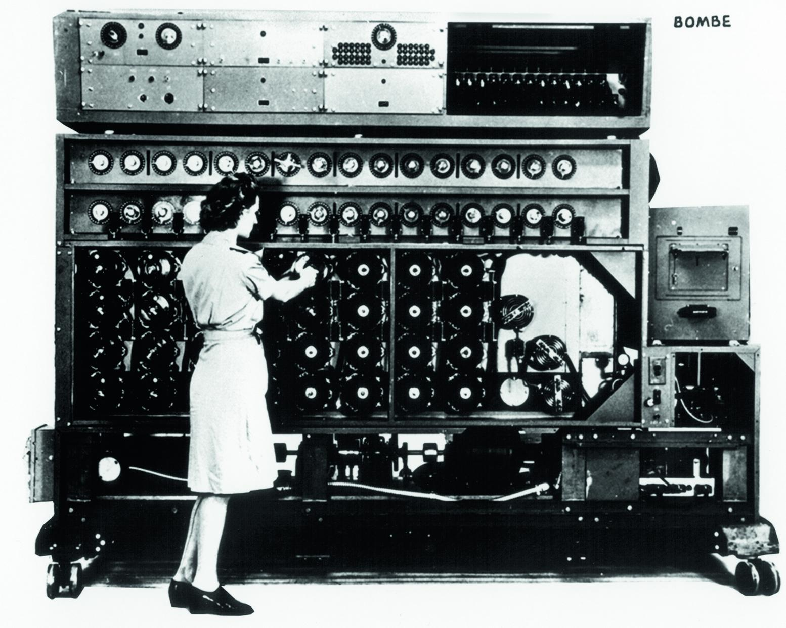
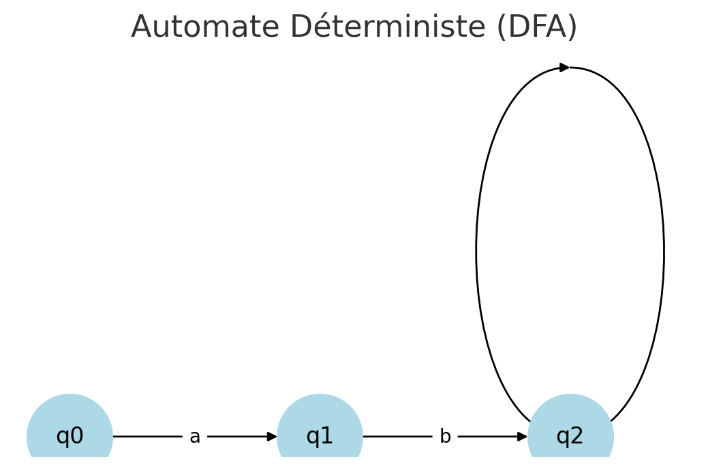
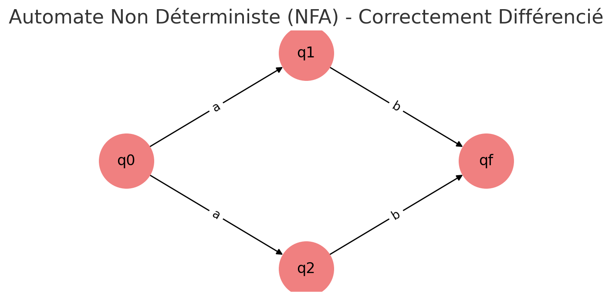
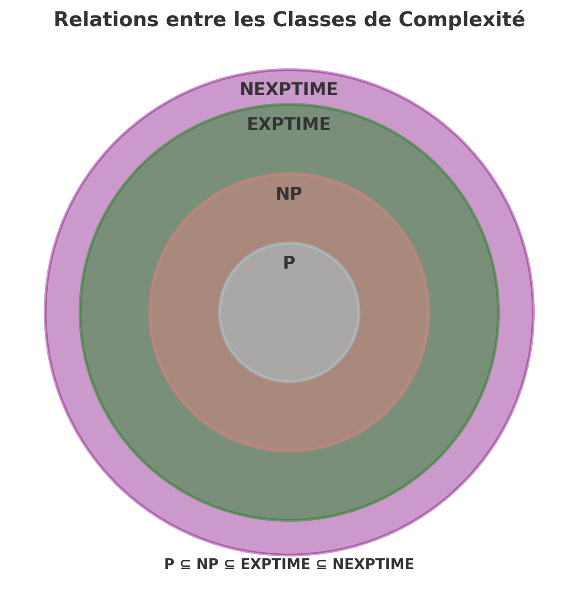

# La complexité algorithmique

## Introduction à la théorie de la complexité

**P = NP** ?

En informatique théorique, la question 𝑃=𝑁𝑃 demande si tous les problèmes dont la solution peut être vérifiée rapidement (classe NP) peuvent aussi être résolus rapidement (classe P). Autrement dit, trouver la solution est-il aussi rapide que vérifier une solution déjà donnée ?
Bien que cette question encore non résolue puisse sembler simple au premier coup d'oeil pour un esprit qui ne serait pas familier à l'algorithmique, elle est en fait le premier des "problèmes du millénaire", l'un des sept problèmes mathématiques dits insurmontables et posés en 2000 par l'Institut de mathématiques Clay aux Etats-Unis. Malgré un titre à l'air de défi impossible et une récompense d'un million de dollar fournie par l'Institut pour quiconque résolverait un de ces dits problèmes, le mathématicien britannique Keith Devlin considère le problème **P = NP** ? comme le seul problème compréhensible par tous. Loin d'avoir la prétention de pouvoir faire gagner la récompense suite à le lecture de cet article, ce dernier permettra de mieux aborder la question plus globale de la complexité des algorithmes afin de compendre notamment pourquoi **P = NP?** sera certainement encore un problème du prochain millénaire.

Pour commencer, nous définirons un algorithme comme *"un ensemble de règles permettant de résoudre un problème sur des données d'entrées. Cet ensemble de règles définit une séquence d'opérations qui se termine en un temps fini. Cependant, pour un problème donné il peut exister plusieurs algorithmes possibles"* [^1]. La théorie de la complexité découle alors d'un problème très terre à terre. En effet, dans les années 1960, les premiers gros ordinateurs se diffusent mais ces derniers, comparés aux machines dont nous disposons aujourd'hui, sont très lents et disposent de très peu de mémoire vive. Très vite, les chercheurs se posent donc la question de la complexité des algorithmes: en combien de temps un algorithme peut-il s'exécuter sur une machine donnée ? Surtout, un algorithme peut-il simplement tourner sur cette machine ? Finalement, quel algorithme choisir, lequel sera le plus optimisé ?
Ces questions donnent donc lieu à l'identification de deux types de complexité:

  - **complexité temporelle**: c'est la mesure du temps d'exécution d'un algorithme en fonction de la taille de l'entrée
  - **complexité spatiale**: c'est la mesure de la mémoire nécessaire à l'exécution d'un algorithme
 
En somme,  étudier la complexité d'un algorithme c'est calculer combien de temps il va prendre pour s'exécuter en fonction d'une donnée de taille *n* en entrée. De plus, ici nous ne nous intéresserons pas à la complexité spatiale mais bien à la complexité temporelle car bien que nos ordinateurs n'aient pas de mémoire infinie, nous nous basrons sur le modèle de la machine de Turing (qui elle possède une mémoire infinie par définition) que nous détaillerons ensuite. En pratique, la mémoire d'un ordinateur, par sa taille, peut aujourd'hui être considérée comme infinie. De plus, nous pouvons la considérer comme infinie de manière théorique car elle est extensible par l'ajout de composants[^2]. 

Afin de mieux saisir ce que représente la complexité d'un algorithme dans la pratique, prenons en exemple le code suivant:
```python
def diviseurs(n:int):
    liste_diviseurs = []
    for i in range (1, n+1):
        if n%i == 0: #Soit si i est un diviseur de n
            liste_diviseurs.append(i)
    return liste_diviseurs
```
Ici, plusieurs opérations sont nécessaires pour exécuter cet algorithme:

 - une affectation: liste_diviseurs=[ ]
 - n calculs de reste: n%i
 - n comparaisons: n%i == 0
 - x opérations d'ajouts à la liste liste_diviseurs. x est donc au moins égal à 1 (par exemple si n=1 puisque 1 ne peut avoir en diviseur que lui-même) et au plus à n (2 par exemple puisque 2 a comme diviseurs 1 et 2).

Le nombre d'opérations pour cet algorithme varie donc entre 2n+2 et 3n+1. Le nombre d'opérations nécessaires est proportionnel à *n*. Si on affecte un temps constant à une opération élémentaire (ici l'affectation par exemple) alors le temps pour exécuter l'algorithme est propotionnel à n. 

Prenons en comparaison ce deuxième algorithme:
```python
import math
def diviseurs(n:int):
    liste_diviseurs = []
    for i in range (1, int(math.sqrt(n))+1):
        if n%i == 0: #Soit si i est un diviseur de n
            liste_diviseurs.append(i)
            if n//i!=i: #Si le quotient de n par i est différent de i, alors on ajoute ce quotient 
            #comme nouveau diviseur de n
                liste_diviseurs.append(n//i)
    return liste_diviseurs
```
Ici, cet algorithme s'appuie sur le fait que si p est un diviseur de n alors on peut écrire n=p×q, avec p>=√n,  alors q est un diviseur de n inférieur ou égal à √n. Pour les esprits moins scientifiques, pour résumer le programme suivant, nous pouvons dire qu'il cherche tous les diviseurs inférieurs ou égal à √n puisqu'une propriété mathématique nous dit que n peut s'écrire sous la forme p\*q (p et q entiers naturels) avec p forcément inférieur ou égal à la racine de n. L'algorithme cherche donc d'abord à trouver tous ces p. Ensuite, il ajoute tous les q. Pour cet algorithme, on fait donc les opérations suivantes:

- une affectation : liste_diviseurs= [ ]
- un calcul de racine carrée: math.sqrt(n)
- √n calculs de reste: n%i
- √n comparaisons: n%i==0
- Entre 1 et √n calculs de quotient: n//i
- Entre 1 et √n comparaisons: n//i !=i
- x opérations d'ajouts à la liste liste_diviseurs. x est au moins égal à 1 et au plus à 2×√n.×

Le nombre d'opérations pour cet algorithme varie donc entre 2×√n+5 et 6×√n+2. Le nombre d'opérations est donc proportionnel à √n. 

On voit donc à travers l'exemple de ces deux algorithmes que le nombre d'opérations peut varier fortement pour obtenir le même résultat en sortie, on a donc bien des différences en terme de complexité. Par exemple ici pour n=100 le nombre d'opérations avec le premier algorithme varie entre 202 et 301 et entre 25 et 62 pour le deuxième. 

## Types de problèmes algorithmiques

Les problèmes algorithmiques se distinguent en deux types:

- Les problèmes dits décisionnels de type booléens, dont la réponse est vraie ou faux, par exemple: "n a-t-il exactement deux diviseurs ?"
- Les problèmes dits de recherche d'une solution, par exemple: "Quels sont les diviseurs de n ?"

Toutefois, certains problèmes de recherche de solution peuvent être transformés en problèmes décisionnels dits équivalents. Si nous posons la question: "Existe-t-il une suite finie de nombre contenant tous les diviseurs de n?" le problème est d'ordre décisionnel mais il faudra bien le même nombre d'étapes que pour le problème de recherche à la machine pour y répondre. 

## Modèle de calcul utilisé

Bien qu'il existe plusieurs méthodes de calcul, nous nous basons ici sur celui de la machine de Turing. Ce modèle de machine est un modèle théorique défini par Alain Turing en 1936 afin de formaliser la notion de calculabilité et d'algorithme. Pour résumer, la machine de Turing est composée de trois éléments:

- un ruban infini (mémoire de la machine)
- une tête de lecture et d'écriture (qui lit et écrit sur le ruban)
- un tableau de règles autrement appelé partie de contrôle

Le ruban est divisé en plusieurs cases qui contiennent toutes un symbole, ici nous prendrons pour exemple les symboles 0, 1 ou un espace symbolisé par "_". La tête de lecture et d'écriture se déplace de case en case et peut lire les symboles associés ainsi qu'écrire un nouveau symbole. Elle possède également un état qui peut changer en fonction du tableau de règles. C'est ce tableau qui indique à la machine son état actuel, quel symbole est lu, quel symbole écrire ensuite, où se déplacer et quel état adopter. On peut modéliser cela par un exemple dans le tableau suivant: 

|Etat          | Symbole lu   |Ecrit         |Deplace       | Nouvel Etat  |
|:------------:|:------------:|:------------:|:------------:|:------------:|
|A |1|0|droite|A|
|A|_|_|Stop|HALT|

*Exemple de tableau des transitions*

Ici, si on soumet à la machine le ruban 1 1 1 _ _ _ _, le ruban en sorti sera 0 0 0 _.

Pour la machine de Turing, on mesure la complexité temporelle par le nombre d'étapes élémentaires de calcul et la complexité spatiale par le nombre de cases du ruban qui sont utilisées durant le calcul (par analogie, on parlerait en unité de mémoire pour un ordinateur). C'est donc cette mesure de complexité temporelle que nous utilisons dans l'exemple de la section précédente (code Python). Ici nous nous sommes intéressés à une machine à bande unique mais il est bien sûr possible d'en considérer avec plusieurs bandes, ou même avec une bande unique dite bifinie (innfinie à droite et à gauche). 

 

*Exemple de machine de Turing, source: Alan Turing et le décryptage des codes secrets nazis, CNRS Le Journal*

## Machines déterministes, machines non déterministes

L'exemple précédent concernant la Machine de Turing était celui d'une machine dite déterministe, c'est-à-dire d'une machine où pour chaque état et chaque entrée, il existe une seule transition possible. Dit plus simplement, cela signifie que si nous donnons la même entrée à la machine plusieurs fois, elle produira toujours le même résultat. 
Pour les machines non-déterministes, à un état donné, plusieurs transitions sont possibles pour la même entrée. Afin de mieux comprendre on peut regarder les deux schémas suivants: 
 

Ici un seul chemin est possible: si la machine lit a, elle passe à q1, si elle lit b, elle passe à q2...

 

Ici, en lisant a, la machine peut passer soit à q1 soit à q2, elle teste plusieurs chemins en même temps. 

## Algorithmes efficaces, algorithme inefficaces

La première référence à l'efficacité des algorithmes remonte à 1956 lorsque le mathématicien autrichien Kurt Gödel écrit à son homologue hongrois von Neumann pour lui demander s'il existe un algorithme quadratique, c'est-à-dire un algorithme dont le nombre d’opérations est proportionnel à *n*² où *n* est la taille des données d'entrée, pour le problème SAT (Satisfiabilité Booléenne) qui consiste à déterminer si une formule booléenne peut être évaluée à vrai en attribuant des valeurs de vérité (true/false) aux variables [^3]. 
Par la suite, c'est la définition de Cobham [^4] ainsi que celle d'Edmonds [^5] qui s'imposent comme universelles: un algorithme efficace fonctionne en temps polynomial, soit si le nombre d'opérations qu'il effectue est borné par une fonction de la forme :
*O(n<sup>k</sup>)* où : 
- *n* est la taille de l'entrée
- *k* est une constante

Ainsi, un algorithme est dit efficace si le nombre d'opération effectué est de la forme de la fonction présentée ci-dessus, on dit alors qu'il est **dans P** (pour polynomial). Afin de mieux comprendre, nous pouvons considérer le tableau suivant qui présente le temps nécessaire à l'exécution de plusieurs algorithmes en fonction des données en entrée :
|            | Nom courant  | Temps pour *n* = 10⁶             | Remarques |
|:------------:|:--------------:|:-------------------------------------:|:-----------:|
|*O*(1)      |Temps constant| 1 ns                                | Le temps d'exécution ne dépend pas des données traitées.|
|*O*(log *n*)|logarithmique | 10 ns                               |En pratique, cela correspond à une exécution quasi instantanée.|
|*O(n)*      |linéaire      | 1 ms                                |Le temps d'exécution d'un tel algorithme ne devient supérieur à une minute que pour des données de taille comparable à celle des mémoires vives disponibles actuellement. Le problème de la gestion de la mémoire se posera donc avant celui de l'efficacité en temps.|
|*O*(*n*²)   |quadratique   |15 mn                                |Cette complexité reste acceptable pour des données de taille moyenne (*n*<10⁶) mais pas au-delà avec la plupart des processeurs actuels.|
|*O*(*n<sup>k</sup>*)|polynômiale   | 30 ans pour *k* = 3                 |Ici *n<sup>k</sup>* est le terme de plus haut degré d'un polynôme en n.|
|*O*(*2<sup>n</sup>*)|exponentielle | plus de 10³⁰⁰ ⁰⁰⁰ milliards d'années|Un algorithme d'une telle complexité est impraticable sauf pour de très petites données (*n*<50). Algorithme inefficace.|

Table - *Ordre de grandeur des temps d'exécution d'un problème de taille 10⁶ sur un ordinateur à un milliard d'opérations par seconde*

On comprend donc grâce au tableau qu'un algorithme efficace ne peut être que de la forme polynômiale (au maximum avec n⁴) pour pouvoir être exécutable. On précise toutefois que le temps nécessaire calculé ici ne prend pas en compte les performances techniques de la machine car on reste sur le même ordre de grandeur. 

## Classes de complexité

Nous l'avons vu, un algorithme efficace se résout en temps polynomial. Mais il existe d'autres ordres de grandeurs qu'on appelle alors classes de complexité en temps (il en existe aussi pour la mémoire). Elles peuvent être regroupées dans le schéma suivant (toutes les classes de complexité n'y figurent pas, on choisit les prinncipales): 
 

## Bibliographie : 


Sylvain Perifel, Complexité algorithmique, Ellipses, 2014

Olivier Carton, Langages formels, calculabilité et complexité, 2008 

 Alan Turing, On Computable Numbers, with an Application to the Entscheidungsproblem : Proceedings of the London Mathematical Society, London Mathematical Society, 1937
 
 Alan Turing et Jean-Yves Girard, La machine de Turing, Paris, Éditions du Seuil, 1995
 
## Sitographie

Complexity Zoo: https://complexityzoo.net/ 

[^1]: Courrier, N. (2021), *Complexité temporelle des algorithmes* \[Cours Magistral], Classe Préparatoire aux Grandes Ecoles PTSI Lycée Chaptal

[^2]: voir Sylvain Perifel, "La Machine de Turing", dans *Complexité algorithmique*, Ellipses, 2014, p.7

[^3]: voir la lettre de Gödel à Von Neumann en 1956 dans [« Gödel’s Lost Letter and P=NP : a personal view of the theory of computation»](https://rjlipton.com/the-gdel-letter/), sur la page de Richard J. Lipton.

[^4]: Alan Cobham. « The Intrinsic Computational Difficulty of Functions ». In: *Logic, Methodology and Philosophy of Science, proceedings of the second International Congress, held in Jerusalem*, 1964.

[^5]: Jack Edmonds. « Paths, Trees, and Flowers ». In:  *Canad. J. Math* 17 (1965),p. 449–467
